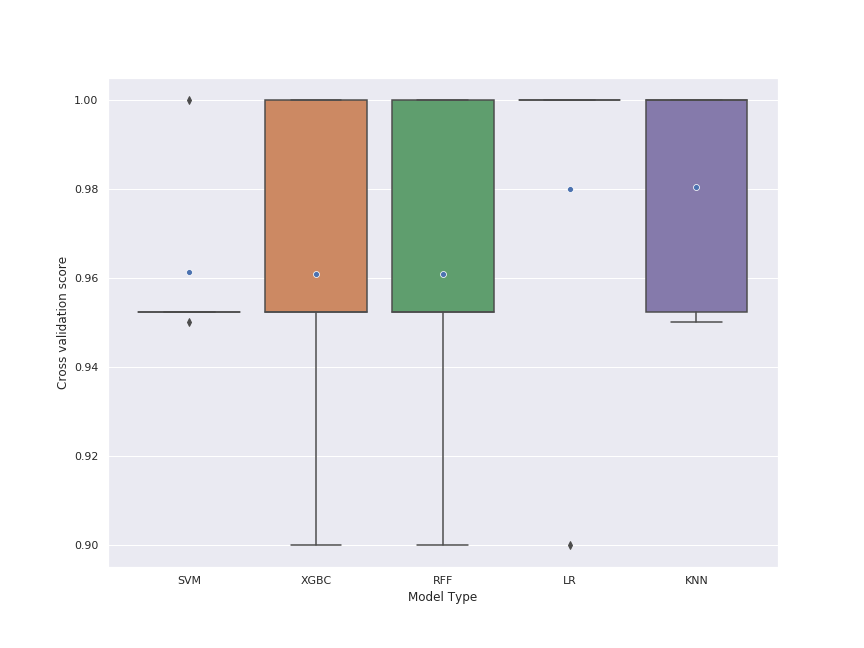

### General report - Task 1

1) The aim of this task is to build model to classify iris flowers species.
2) Methods:
    
        2.1) At first, data was loaded as pandas DataFrame, then analyzed and cleaned of missing and non-numerical values.
        2.2) Then data was standardized using StandardScaler. Following Scikit learn documentation, standardization, 
             in general, is required for machine learning estimators because they may behave badly if the individual 
             features do not look like standard normally distributed data.
        2.3) Processed data set was split into 70% train set and 30% test set.
        2.4) A couple of models are build and optimized using GridSearchCV function. Investigation of prediction 
             skills of models (differing in hyperparameters such as type and strength of regularization, number of 
             trees / k-neighbors, type of "kernel tricks" or type of distance metric) will allow choosing the 
             optimal model (s) used for prediction.
    
        Used models and range of hyperparameters:
      
            *  K-Neighbors Classifier (KNN):
                * hyperparameters: number of k - odds numbers from range 1-15;
                                   p value: 1 - manhatan distance or 2 - euclidian distance.
              
                    
            * Random forest with bootstrap (RFF):
                * hyperparameters: numer of trees - numbers from range 100-1000.
            
            
            * Supporting Vector Machines (SVM):
                * hyperparameters: regularization parameter - numbers from range 0.1 - 10
                                   kernel: polynominal (degree 2-5), sigmoidal, radial basis function - RBF
                                   kenrel coefficent: scale or auto.
                                   
            * Logistic Regression ElasticNet (LR):
                * hyperparameters: inverse of regularization strength in range 0.1 - 10
                                   l1_ratio, in range 0 - 1. (0 - mean penalty='l2', 1 mean penalty='l1', 
                                   0 < l1_ratio <1 - penalty is a combination of L1 and L2.)
    
            * XGBoost (XGB):
                * hyperparameters: numer of trees - numbers from range 100-1000
             
        For all estimators and split data random_state is 101, to make results repeatable. 
        All of the estimators were saved using joblib.                 
        
        3) Models were evaluated using metrics such as:
            * Recall
            * Precision
            * F1
            * Cross-validation scores, wtih numer of folds = 5
            * Area under ROC
            
        4) Statistical tests:
            * Level of significance = 0.05
            * Compiliance with normal distribution was tested using Shapiro-Wilk test.
            * Hypothesis that the population median of all of the groups are equal was tested using Kruskal-Wallis test.
             
3) Results:
        
    Models were evaluated, it was observed that all of them have similar general accuracy 
    from **93% - 96%** and mean of cross-validation (cv) scores **96% - 98%**. The mean and distribution of 
    cv scores visualised on plot bellow. It was noted that 
    SVM and LR estimators have smaller inter-quartile range than others estimators. It indicate that 
    SVM and KNN retain more stable results, when they are training and testing on different folds of training-set.
    It may mean that in future validation-tests, these estimators will keep their metrics at similar level. 
    Distribution of cv scores between samples (models) was tested, because not all of the sets with cv scores for each 
    models have normal distribution, testing was performed using no-parametric test. There were no statistically 
    significance differences between samples.
    
    It is important to note that despite the similar cv scores. Models make mistakes miscellaneous, proof of that 
    are different occurrence of false positive (FP, showed by precision) and false negative (FN, showed by recall) 
    results.
    Metrics for each class of target values are available from [classification report](General_Models_Metrics.txt). 
    The highest average of F1 (weighted average of the precision and recall) has LR model.
    
    The highest value of Area Under the ROC have LR and SVM models but they differed in precision and recall,
    they were used to create voting classifier with soft system (in case of two estimators majority voting may not work). 
    The metrics of voting classifier does not increase, but model still can be more useful in case of 
    new test data sets.
    
